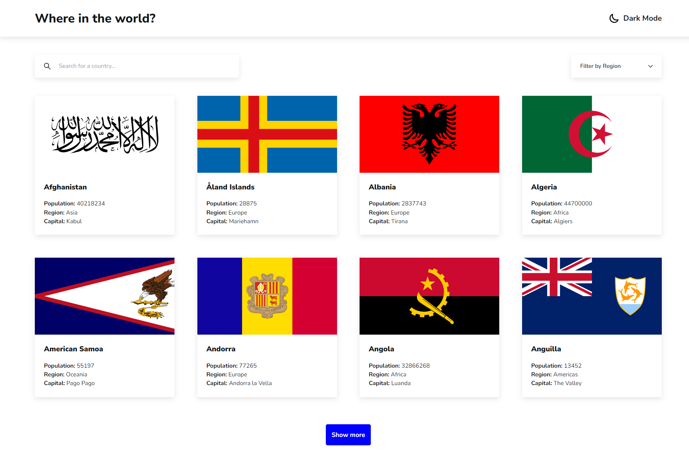

# Desafio Front-end - Countries Page

## Sumário:

- [Visão Geral](#visão-geral)
  - [Sobre o Desafio](#sobre-o-desafio)
  - [Links](#links)
- [Sobre o Processo](#sobre-o-processo)
  - [Tecnologias Utilizadas](#tecnologias-utilizadas)
  - [O que eu aprendi](#o-que-eu-aprendi)
  - [O que preciso focar mais](#o-que-preciso-focar-mais)

## Visão Geral

### Sobre o Desafio

Esse desafio se baseia em desenvolver uma webpage responsiva que disponibiliza informações os países do mundo, como: a bandeira, nome, população, continente (região), capital, nome nativo, sub-região, moedas, top-level-domain e língua; tudo isso integrando um sistema de busca pelo nome do país ou sua região.

Os usuários devem ser capazes de:

- Ver todos os países da lista na página inicial ✅
- Pesquisar por um país através de seu nome ✅
- Filtrar países por região ✅
- Clicar em um país para ver informações mais detalhadas em uma página separada ✅
- Alterne o esquema de cores entre o modo claro e escuro ✅
- Ser capaz de redirecionar para páginas países vizinhos ✅

### Links

- 
Preview on Vercel:

## Sobre o Processo

Confira nessa sessão quais foram as tecnologias e conceitos mais utilizados nesse desafio:

### Tecnologias utilizadas

 &nbsp;
 &nbsp;
 &nbsp;
 &nbsp;

- <b>NextJS</b>: framework front-end baseado em React, usado para construir interfaces com base em componentes.
- <b>SCSS</b>: pré-processador css utilizado para facilitar a padronização e estilização de componentes.
- <b>Tailwind</b>: framework css que fornece classes utilitárias para estilização de componentes.
- <b>ContextAPI</b>: uma solução nativa do React, em forma de Hook, para disponibilizar dados entre componentes React.

### O que eu aprendi?

  - Nesse desafio eu pude colocar em prática meus conhecimentos acerca do framework NextJs, utilizando de conceitos únicos da ferramenta como o sistema de paginação nativo e renderização de componentes React em ambos os lados (servidor e cliente); além de aprender outros conceitos como ContextAPI e o uso do framework css Tailwind para estilização utilitárias.

### O que preciso focar mais?

- Sinto que ainda preciso aprender muita coisa acerca do mindset de desenvolvimento de webpages com o NextJs, para poder usufruir de todo seu potencial;
- Aprender a quando utilizar tailwind ou css/scss para estilizar componentes;